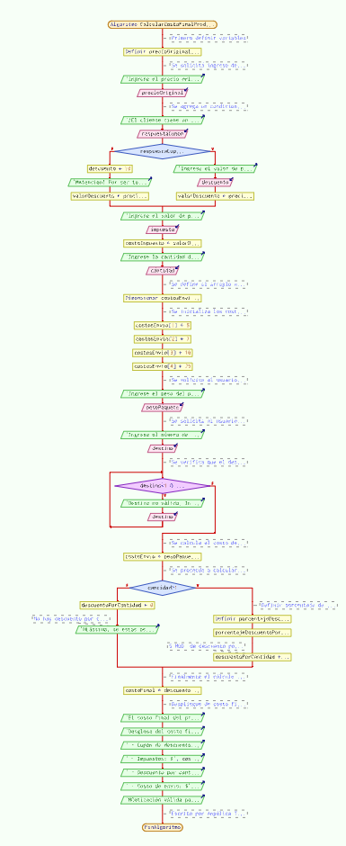
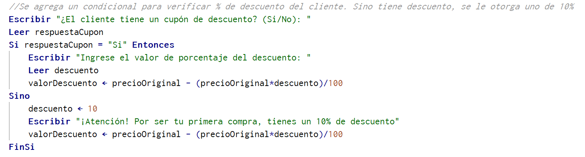
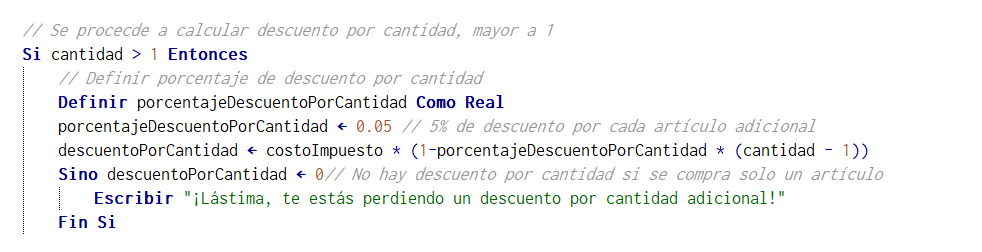
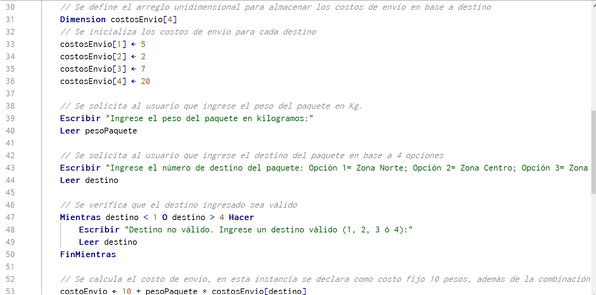
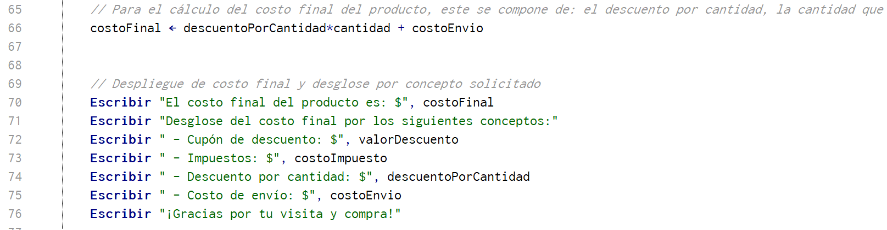

# Módulo 1 - Proyecto 1
## ¡Bienvenidos al proyecto "Algoritmo de Costos"!

## Tabla de Contenidos
* [1. Desafío](#1-Desafío)
* [2. Análisis](#2-Análisis)
* [3. Supuestos para proyecto](#3-Supuestos-para-proyecto)
* [4. Pseudocódigo y explicaciones generales](#4-Pseudocódigo-y-explicaciones-generales)
* [5. Conclusiones](#5-Conclusiones)

****
## Desarrollo

### 1. Desafio
 Para el primer proyecto se solicita generar un algoritmo en pseudocódigo, específico para PSeInt, simulando un sistema de cálculo de costo de un producto, y considerando de base el precio original y un porcentaje de descuento. Se debe cumplir con los siguientes requerimientos:
- Lectura de precio original
- Aplicación de descuento, si el cliente posee cupón de descuento
- Aplicación de impuestos al producto
- Considerar si el cliente aquiere más de un artículo, se aplicará un descuento por cantidad
- Cálculo de costo de envío en base a dos variables: destino y peso del paquete
- Cálculo de costo final de producto considerando componentes de: descuento, impuestos, descuento por cantidad y costo de envío.
- Mostrar costo final del producto, incluyendo desglose de los componentes: descuentos, impuestos, descuento por cantidad y costo de envío.

  ****
  
### 2. Análisis
 En base al desafío planteado, se inicia el análisis y preparación del pseudocódigo considerando los requisitos como guía basal para la construcción del mismo, lo cuál debe cumplir con:
- Lectura del precio original
- Lectura de porcentaje de descuento aplicado
- Cálculo de precio final de producto, post descuento
- Muestra de precio final de producto

 Adicionalmente, se debe considerar los factores de: Cantidad de productos, impuesto, peso del paquete y lugar de envío.
Dentro de la estructura del Pseudocódigo, se debe tomar por bloques de lectura, y a su vez que permita obtener cálculos que posteriormente, una vez ejecutado el programa entrege los valores desglosados por conceptos principales.

****

### 3. Supuestos para proyecto
 Aqui se declaran los supuestos para este proyecto, en donde se define:
- La tienda de venta online será: *Tienda online de venta de plantas*.
- Si el cliente no posee un cupón de descuento para su cotización, se le otorgará uno de 10% por su primera compra como cortesía.
- Se define como variable unidimensional el destino de envío, teniendo 4 destinos.
- Para el cálculo de costo de envío, se considera como costo fijo $10, y se incluye la variable de destino, además de la variable de peso del paquete en Kilogramos, esta última a ser definida por el cliente.
- Existe un descuento adicional por cantidad, el cual corresponde a un 5%.

****

### 4. Pseudocódigo y explicaciones generales

Inicialmente en PSeInt se realiza la declaración de variables, como reales. Algunas de ellas son:
- precioOriginal
- descuento
- valorDescuento
- impuesto
- costoimpuesto
- cantidad
- costoEnvio
- pesoPaquete
- costoFinal

 Luego se procede a solicitar el ingreso de variables por parte del cliente, incluyendo comandos de lectura. En esta etapa se ejecutan algunos cálculos, condiciones, bucles, entre otros, que permitirá el almacenaje de los valores a desplegar una vez finalizada la ejecución del programa.
 
 En términos de estructura del programa, PSeInt nos despliega el siguiente diagrama de flujo:

   
   
 En específico, se demuestra a continuación extractos de condicionales que incluyen operaciones:
   - Condicional para cupón de descuento:
     
   
  
   - Condicional para descuento por cantidad:
     
  
  
 En término de dimensiones, se agrega un arreglo unidimensional que almacena los costos de envío en base a un destino, siendo cuatro en total. Además se agrega un bucle para que el cliente realice el correcto ingreso de destino:

 Finalmente para mostrar el costo final y el detalle por concepto buscados por el cliente:

 A modo de prueba, se ingresan las siguientes variables, indicadas como parte del ejemplo en la descripción de problema planteado, en donde:
- Precio original: $100
- Cupón de descuento: 10%
- IVA: 12%
- Cantidad: 2
- Peso del paquete: 3Kg
- Destino de envío: En el ejemplo indicaba New York, considerando un costo de destino de $2. *Para este proyecto, se selecciona la opción  de zona centro, debido al costo que corresponde a $2*

 Resultados esperados:
 - Valor con descuento: $90
 - Valor con impuesto: $100.80
 - Valor de descuento por cantidad; $95.76
 - Costo de envío: $16
 - Costo final: $207.52

 A continuación se demuestra el resultado de la ejecución con las variables indicadas anteriormente:
  

 Se concluye que el pseudocódigo se comporta conforme a lo esperado.
 
[Se incluye Link para visualización del Pseudocódigo](./CalcularCostoFinalProducto_Final_ATC.psc)
  
  ****
  
  ### 5. Conclusiones
  Durante la ejecución del programa, se dió inicio con una estructura básica, primero de lectura de algunas variables hasta llegar a la definición de cupón de descuento, en este primer bloque se generaron pruebas para ir validando si estaba ok o no, en base a ensayos. Se decidió agregar un set de condiciones que permitieran abrir el código en decisiones y jugar con los escenarios posibles. 
  Para poder agregar el arreglo unidimensional, se decidió aplicarlo en la sección de cálculo de costo de envío, en específico en la variable de destino, esto debido a que era el concepto más idoneo en donde poder integrarlo.
  Previo al cierre del programa, se decidió agregar una condición más que permitiera el cálculo del descuento por cantidad de articulos. 
  Finalmente considerando los análisis realizados, además de las pruebas por bloque, se dió paso a que el programa respondiera de forma esperada, considerando los requerimientos solicitados para este desafío.  

  ****

**¡Gracias!**

