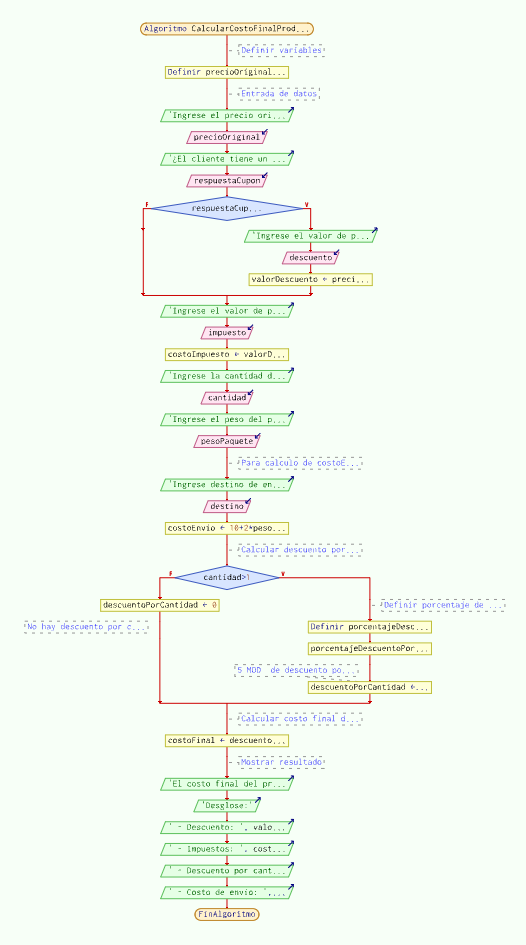
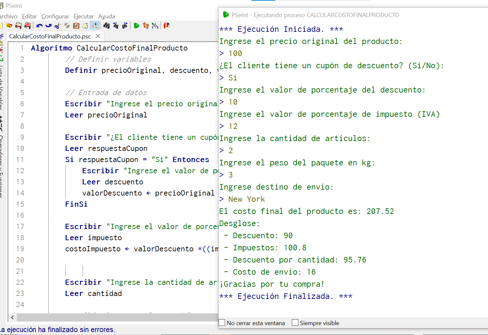

# Módulo 1 - Proyecto 1
## ¡Bienvenido al proyecto "Algoritmo de Costos"!

## Tabla de Contenidos
* [1. Desafío](#1-Desafío)
* [2. Análisis](#2-Análisis)
* [3. Supuestos para proyecto](#3-Supuestos-para-proyecto)
* [4. Código y explicaciones](#3-Código-y-explicaciones)
* [5. Resultado](#4-Resultado)
* [6. Conclusiones](#5-Conclusiones)

****
## Desarrollo

### 1. Desafio
Generar algoritmo en pseudocódigo PSeInt simulando un sistema de cálculo de costo de un producto, considerando de base el precio original y un porcentaje de descuento. Se debe cumplir con los siguientes requerimientos:
- Lectura de precio original
- Aplicación de descuento, si el cliente posee cupón de descuento
- Aplicación de impuestos al producto
- Considerar si el cliente aquiere más de un artículo, se aplicará un descuento por cantidad
- Cálculo de costo de envío en base a dos variables: destino y peso del paquete
- Cálculo de costo final de producto considerando componentes de: descuento, impuestos, descuento por cantidad y costo de envío.
- Mostrar costo final del producto, incluyendo desglose de los componentes: descuentos, impuestos, descuento por cantidad y costo de envío.

  ****
  
### 2. Análisis
En base al desafío planteado, se inicia el análisis y preparación del pseudocódigo considerando los requisitos como guía basal para la construcción del mismo, lo cuál debe cumplir con:
- Lectura del precio original
- Lectura de porcentaje de descuento aplicado
- Cálculo de precio final de producto, post descuento
- Muestra de precio final de producto

Adicionalmente, se debe considerar los factores de: Cantidad de productos, impuesto, peso del paquete y lugar de envío.

****

### 3. Supuestos para proyecto
Los Supuestos para este proyecto en particular son:
- La idea será relacionada a una *Tienda online de venta de plantas*
- Se considerará como impuesto el aplicable en Chile, correspondiente al 19% del valor del producto
- Descuento adicional por cantidad se considerará un 5%

****

### 4. Código y explicaciones

1.Inicialmente en PSeInt se realiza la declaración de variables, como reales. Algunas de ellas son:
- precioOriginal
- descuento
- valorDescuento
- impuesto
- costoimpuesto
- cantidad
- costoEnvio
- pesoPaquete
- costoFinal

  Luego se procede a solicitar el ingreso de variables por parte del cliente. En esta etapa se ejecutan cálculos y condiciones, para almacenar los valores que posteriormente que se desplegarán al finalizar la ejecución del programa.
  El diagrama de flujo demuestra lo siguiente:
  

En base al ejemplo y las variables entregadas, se procede a realizar las pruebas y se obtiene el resultado esperado. Se demuestra a continuación:
  

  
  ****

  ### 5. Resultado
  En desarrollo

  ****

  ### 6. Conclusiones
  En desarrollo

  ****

